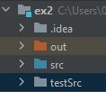

<B>Tests for the Board Class</B>,
featured in Exercise 2 of the new "Introduction to OOP" course,
HUJI, Winter 2021-2022 Semester. \
Written by Erel Debel.

The tests can be configured and run by:
1. Put the test directory, _testSrc_, in your project directory (in the same directory as "src" and "out"):

    
2. Open the project in _IntelliJ_ if you haven't yet. 
3. Right-click the _testSrc_ directory and choose  
  _Mark Directory as -> Test Sources Root_:
4. Open the file _BoardTest.java_ inside the _testSrc_ directory.
5. On the first line' hover mouse over the red text and press _Alt+Enter_:
6. Then choose _JUnit 5_:
  
7. Click the Green arrows next to the class name or press _Ctrl+Shift+F10_ to run the test.

Good luck!\
Erel